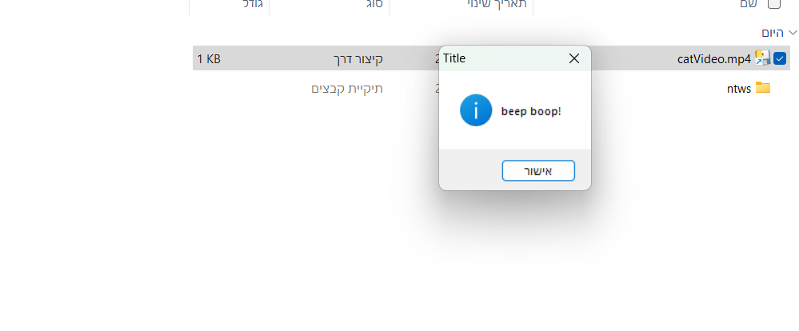

# ExeHidder
## **ExeHidder is an automatic python script that takes a .exe file "hides" it and creates a corresponding copy of it that look like normal non executable files.**

## Note
ExeHidder is a fun little project I worked on for fun, it's mostly useless yet still have some uses on non tech savvy people.
kinda sucks but even after many many tries to make the icon of the shortcut work, I couldn't find a solution as windows don't let shortcuts have relative paths to icons,
I even tried to create a C++ program that will embedd the icon into the scr file, but no success there as well-- will edit when succeeds 

## What it does & How it works
Basically the script creates a zip file that contains a shortcut file that links to the .exe file the user provided, the real exe file is supposed to be a hidden file but winrar,7zip and so on show these files,
so I decided to make some fake folder and put the exe inside them, the exe file is changed to the name of the fake file and its extension is changed to a .scr file to reduce suspicion even though scr and exe do the same thing.

Winrar and 7zip will show the .lnk file but nowadays windows 11 comes with its own file archiver so most users don't download winrar and its rivals, the windows 11 file archiver does not show the .lnk so this script works well against windows 11 users.

## Usage
The user gives the script these inputs: path to .exe file, path to where the zip should be created, the fake extension of the file (could be whatever as it doesn't really counts as an extension but as text), a path for an icon (optional) and name of zip.

